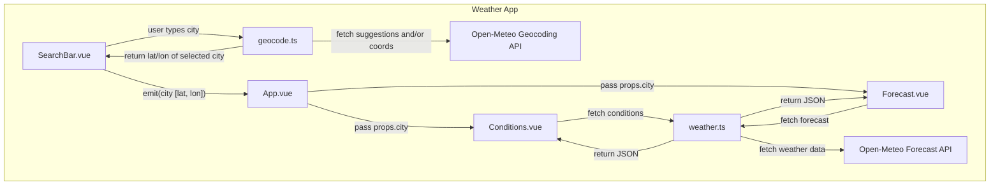

# Simple Weather App

A lightweight Vue 3 app that displays current weather conditions and a 5-day forecast for a selected city. The app fetches data from the [Open-Meteo API](https://open-meteo.com/) and allows searching cities with autocomplete.

## Setup & Run
1. Clone the repository
2. Install dependencies using `npm install`
3. Build the repo using `npm run dev` or `npm run build`

## Architecture Overview

## Tradeoffs and Assumptions
- using Vuetify: limited customization but easier to plug and play
- the searchbar calls were faster pre-modularization, but I did want to isolate out that code
- assuming that the OpenMeteo API is super reliable: not doing retries, and also assuming that I'll always get 5 results when I request 5
- storing weather codes and icon references in a static way is not future-proof
- also assumed manual testing was enough for this quick app
- no "backend" repo: if it was a more heavyweight app, I would want to isolate "processing" to a backend microservice, and also store things in an actual database rather than Pinia

## How to Run Tests
There are no tests currently implemented as I was low on time. Testing could be set up using Playwright (or alternatives). Tests could be created for:
- checking that getCities() correctly formats geocoding results
- checking that SearchBar.vue emits the correct payload on selection
- testing the whole user flow: typing a city, then selecting it, and checking that weather data loads as expected
- checking loading and error states, and validating that  spinners and error messages appear 

## Potential New Features
- Farenheit vs Celsius Toggle
- Temperature graph, maybe with red and blue lines for highs vs lows

## AI Assistance
I used ChatGPT for syntax and debugging assistance. 